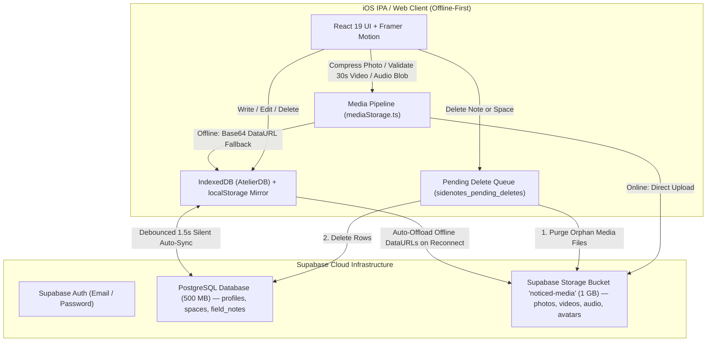
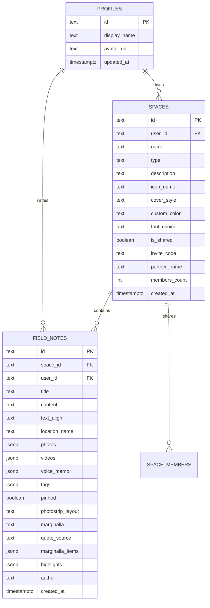

# NOTICED — Technical & Product Whitepaper (v1.0)

> **"for things you don't want to forget"**  
> *A quiet, offline-first personal & shared field notebook engineered with Apple-Style High-Density Liquid Glass, Penguin Classics editorial typography, and hybrid Supabase Cloud & Media Storage synchronization.*

---

## Daftar Isi

1. [Ringkasan Eksekutif & Filosofi Produk](#1-ringkasan-eksekutif--filosofi-produk)
2. [Sistem Desain & Estetika Editorial](#2-sistem-desain--estetika-editorial)
3. [Fitur Utama & Pengalaman Pengguna (UX)](#3-fitur-utama--pengalaman-pengguna-ux)
4. [Arsitektur Sistem & Hybrid Data Pipeline](#4-arsitektur-sistem--hybrid-data-pipeline)
5. [Skema Database PostgreSQL & Supabase Storage](#5-skema-database-postgresql--supabase-storage)
6. [Rekayasa iOS Native (IPA), Safe Area & Haptics](#6-rekayasa-ios-native-ipa-safe-area--haptics)
7. [Peta Struktur Direktori & Organisasi Kode](#7-peta-struktur-direktori--organisasi-kode)
8. [Panduan Build, Deployment & Pemeliharaan](#8-panduan-build-deployment--pemeliharaan)

---

## 1. Ringkasan Eksekutif & Filosofi Produk

**Noticed** adalah aplikasi buku catatan lapangan (*field notebook*) dan ruang jurnal editorial yang dirancang khusus untuk menangkap pengamatan sehari-hari, kutipan buku, catatan kaki (*marginalia*), potongan foto polaroid/strip, klip video pendek 30 detik, hingga memo suara taktil.

Berbeda dari aplikasi catatan produktivitas korporat yang kaku, **Noticed** menggabungkan dua dunia:
1. **Keanggunan Buku Cetak Klasik (*Penguin Classics & Moleskine*)**: Tata letak aliran naskah (*manuscript stream*), penomoran catatan kaki superskrip (`¹`, `²`, `³`), stabilo teks berlapis, dan sampul buku bertekstur kain *buckram* dengan embos foil.
2. **Presisi Antarmuka iOS Modern (*High-Density Liquid Glass*)**: Permukaan kaca buram berlapis (*frosted translucent surfaces*), pantulan tepi spekular (*caustic specular rims*), umpan balik getaran taktil (*haptics*), dan transisi pegas fisik (*spring physics*).

---

## 2. Sistem Desain & Estetika Editorial

### 2.1. Palet Tema Monokrom Hangat (4 Resolusi)
Noticed menerapkan empat tema warna terkurasi yang dikendalikan melalui atribut `data-theme` pada elemen `:root`:

| Tema | Mode | Karakteristik Visual | Warna Dasar (`--bg-base`) | Tinta Utama (`--text-primary`) |
| :--- | :--- | :--- | :--- | :--- |
| **Warm Paper** | Light | Kertas linen krem alabaster klasik | `#F7F5F0` | `#1C1917` |
| **Daylight** | Light | Porselen putih bersih bertepi perak | `#FFFFFF` | `#111113` |
| **Obsidian** | Dark | Batu tulis malam monokrom pekat | `#111113` | `#F5F5F4` |
| **Espresso** | Dark | Kulit kayu mahoni & kopi sangrai gelap | `#181412` | `#F4EFEA` |

### 2.2. Tipografi Tiga Karakter
Setiap buku catatan (*Space*) dapat memilih kepribadian tipografinya sendiri:
- **Editorial (`Newsreader`)**: Serif sastra untuk membaca panjang dan refleksi buku.
- **Classic Display (`Cormorant Garamond`)**: Serif kontras tinggi bergaya majalah seni & jurnal klasik.
- **Geometric Sans (`Urbanist`)**: Sans-serif modern yang bersih untuk catatan harian cepat.
- **Metadata & Indeks (`Courier Prime` / `Space Mono`)**: Huruf mesin tik *monospaced* untuk penanda tanggal, waktu, koordinat lokasi, dan nomor indeks.

### 2.3. Aturan Ikonografi Ketat
Seluruh kontrol antarmuka wajib menggunakan ikon garis vektor dari `lucide-react` (`strokeWidth={1.5}` hingga `2.25`). Penggunaan emoji sistem berwarna pada tombol dan navigasi dilarang sepenuhnya demi menjaga keselarasan visual monokrom.

---

## 3. Fitur Utama & Pengalaman Pengguna (UX)

### 3.1. Spatial 3D Bookshelf (`BookshelfModal.tsx` & `BookshelfSpine.tsx`)
- **Mode Spines (Punggung Buku)**: Buku-buku berjajar di atas pedestal kayu/kaca dengan tekstur kain *buckram*, pita kapital (*headband*), motif foil emas/perak/kobalt, serta *Live Spine Preview* saat mengedit buku.
- **Mode Covers (3D Spatial Carousel)**: Karusel perspektif 3D *edge-to-edge* (`perspective: 1400px`) yang menampilkan sampul buku bertekstur fisik.
- **Time-Zone Aware Greeting**: Pill profil di sudut kiri atas menyapa pengguna secara dinamis mengikuti zona waktu perangkat (*Good Morning / Afternoon / Evening / Night*) beserta titik indikator sinkronisasi cloud.

### 3.2. Editorial Manuscript Stream (`NoteEntry.tsx`)
- **Inline Text Highlighter (`TextHighlighter.tsx`)**: Seleksi kalimat langsung di dalam catatan untuk memberi warna stabilo (*Amber, Sage, Cobalt, Rose*) atau menautkan *Marginalia* (catatan pinggir/kutipan) dengan angka superskrip otomatis.
- **Quick Annotator (`QuickAnnotatorModal.tsx`)**: Menambah dan menyunting *sidenote* atau sumber kutipan langsung dari aliran catatan tanpa membuka editor penuh.
- **Inline Autoplay Video (`InlineVideoPlayer.tsx`)**: Klip video pendek (maks 30 detik) diputar otomatis tanpa suara (*muted loop*) saat terlihat di layar menggunakan `IntersectionObserver` (`threshold: 0.65`), dilengkapi tombol suara *Liquid Glass* dan bilah progres 2px.
- **Photostrip & Polaroid Layouts (`PhotostripModal.tsx`)**: Menampilkan lampiran foto dalam tata letak strip vertikal, kolase berdampingan, atau tampilan penuh dengan stempel waktu.
- **Tactile Voice Memo (`audioRecorder.ts`)**: Perekam suara real-time dengan visualisasi gelombang frekuensi (*Web Audio API AnalyserNode*) 12-bar.
- **Zen Reading Mode & Table of Contents (`NotebookIndexSheet.tsx`)**: Mode baca bebas distraksi yang menyembunyikan seluruh tombol kontrol dan menampilkan bilah progres baca di puncak layar, serta daftar isi kronologis & pencarian cepat (`SpotlightSearchModal.tsx`).

---

## 4. Arsitektur Sistem & Hybrid Data Pipeline

Noticed menganut prinsip **Offline-First dengan Silent Cloud Synchronization**. Aplikasi bekerja 100% instan tanpa koneksi internet menggunakan penyimpanan lokal, dan secara otomatis menyinkronkan data serta file media ke **Supabase** di latar belakang.



### 4.1. Empat Pilar Sinkronisasi (`syncEngine.ts`)
1. **Silent Background Auto-Sync**:
   - Berjalan otomatis secara tenang (`1500ms` *debounce*) setiap kali pengguna menambah/mengedit catatan, marginalia, buku, atau profil.
   - Otomatis terpicu saat perangkat kembali *online* (`window.ononline`) atau saat aplikasi kembali aktif di layar (`visibilitychange`).
2. **Offload Media ke Bucket `noticed-media`**:
   - Foto dikompresi di sisi klien (`1600px`, JPEG `0.82`), video divalidasi (maks 30 detik / 25 MB), dan memo suara direkam, lalu diunggah langsung ke bucket `noticed-media`.
   - Tabel PostgreSQL (`field_notes`) hanya menyimpan URL publik berukuran puluhan byte sehingga kuota database 500 MB mampu menampung ratusan ribu catatan.
   - Jika dibuat saat *offline*, media disimpan sebagai DataURL di IndexedDB dan otomatis diunggah ke bucket `noticed-media` begitu sinkronisasi berjalan saat *online*.
3. **Cloud Delete & Auto-Purge Storage (`queueCloudDeleteNote` / `queueCloudDeleteSpace`)**:
   - Saat catatan atau buku dihapus, seluruh file foto, video, dan memo suara terkait dihapus otomatis dari bucket `noticed-media` (mencegah *orphan files* memenuhi kuota 1 GB).
   - Jika dihapus saat *offline*, ID catatan/buku dan daftar URL medianya disimpan di *Tombstone Queue* (`sidenotes_pending_deletes`) dan dieksekusi ke cloud terlebih dahulu sebelum menarik data baru—mencegah catatan yang sudah dihapus hidup kembali (*zombie notes*).
4. **Cloud-First Starter Priority**:
   - Saat pengguna login di perangkat baru ke akun yang sudah memiliki data di cloud, 3 buku sampel bawaan (`Animal Farm`, `Field Notes`, `Cozy Stash`) yang sudah pernah dihapus tidak akan di-*push* ulang.

---

## 5. Skema Database PostgreSQL & Supabase Storage



### Skrip SQL Migrasi (Idempotent)
Seluruh skrip SQL disimpan di folder [`supabase/`](./supabase/) dan aman dijalankan berulang kali (*idempotent*):
1. [`supabase/schema.sql`](./supabase/schema.sql) — Skema utama tabel `profiles`, `spaces`, `field_notes`, `space_members`, beserta kebijakan Row Level Security (RLS).
2. [`supabase/migrations/20261005_add_videos_to_field_notes.sql`](./supabase/migrations/20261005_add_videos_to_field_notes.sql) — Penambahan kolom `videos JSONB` pada `field_notes`.
3. [`supabase/migrations/20261005_create_storage_bucket.sql`](./supabase/migrations/20261005_create_storage_bucket.sql) — Pembuatan bucket publik `noticed-media` (batas 25 MB/file untuk foto, video, dan audio) beserta kebijakan RLS `SELECT`, `INSERT`, `UPDATE`, dan `DELETE`.

---

## 6. Rekayasa iOS Native (IPA), Safe Area & Haptics

Noticed dikemas menjadi aplikasi iOS native (`.ipa`) menggunakan **Capacitor 8** yang dapat di-*sideload* melalui AltStore, SideStore, atau TrollStore:
- **Dynamic Island Clearance**: Seluruh pill melayang dan notifikasi atas menggunakan perhitungan dinamis:
  ```css
  top: max(calc(env(safe-area-inset-top, 0px) + 14px), 24px);
  ```
- **Home Indicator Clearance**: Seluruh *Bottom Sheet* (`92dvh` tanpa *nested scrollbar*) dan dock bawah memberikan ruang aman untuk bilah geser iOS:
  ```css
  padding-bottom: max(calc(env(safe-area-inset-bottom, 0px) + 14px), 24px);
  ```
- **Tactile Haptics (`src/lib/haptics.ts`)**: Menghubungkan `@capacitor/haptics` (`ImpactStyle.Light`, `Medium`, `Heavy`, dan `NotificationType.Success`) dengan *fallback* pulsa mikro Web Audio API (`6ms–12ms`) pada browser.
- **App Icon Pipeline (`scripts/generate_app_icons.cjs`)**: Menghasilkan ikon aplikasi resolusi `1024×1024` dengan latar **Warm Alabaster Ceramic** (Light) dan **Obsidian Smoked Liquid Glass** (Dark) yang terpusat secara optik.

---

## 7. Peta Struktur Direktori & Organisasi Kode

```text
d:\Project\Sidenotes
├── .env.example                 # Template variabel lingkungan Supabase
├── capacitor.config.ts          # Konfigurasi iOS Capacitor 8 (com.sidenotes.app)
├── GEMINI.md                    # Aturan arsitektur & desain utama
├── PROJECT_RULES.md             # Spesifikasi invariant UI & safe-area iOS
├── README.md                    # Panduan ringkas proyek
├── WHITEPAPER.md                # Dokumen Whitepaper teknis & produk lengkap (dokumen ini)
├── index.html                   # Entry HTML + Google Fonts + viewport-fit=cover
├── package.json                 # Dependensi & skrip build
├── vite.config.ts               # Konfigurasi bundler Vite 8 + Tailwind CSS v4
│
├── public/                      # Aset statis produksi yang ikut dibundle ke IPA
│   ├── logo-dark.png            # Ikon aplikasi Obsidian Liquid Glass (1024x1024)
│   └── logo-light.png           # Ikon aplikasi Alabaster Ceramic (1024x1024)
│
├── scripts/                     # Skrip utilitas aktif
│   └── generate_app_icons.cjs   # Generator ikon iOS 1024x1024 (Light & Dark)
│
├── supabase/                    # Skrip SQL idempotent untuk Supabase
│   ├── schema.sql               # Skema tabel PostgreSQL & kebijakan RLS
│   └── migrations/
│       ├── 20261005_add_videos_to_field_notes.sql
│       └── 20261005_create_storage_bucket.sql
│
├── src/                         # Kode sumber aplikasi utama (100% aktif)
│   ├── App.tsx                  # Orkestrator state, navigasi, & Silent Auto-Sync
│   ├── main.tsx                 # Bootstrap React 19
│   ├── index.css                # Sistem token CSS, tema 4-palet, & kelas Liquid Glass
│   ├── types.ts                 # Kontrak tipe TypeScript (Space, FieldNote, dll)
│   │
│   ├── components/
│   │   ├── notes/               # Komponen aliran catatan & editor
│   │   │   ├── CreateNoteSheet.tsx
│   │   │   ├── DateGroupDivider.tsx
│   │   │   ├── InlineVideoPlayer.tsx
│   │   │   ├── NotebookIndexSheet.tsx
│   │   │   ├── NoteEntry.tsx
│   │   │   ├── PhotostripModal.tsx
│   │   │   ├── QuickAnnotatorModal.tsx
│   │   │   └── TextHighlighter.tsx
│   │   │
│   │   ├── spaces/              # Komponen rak buku 3D & punggung buku
│   │   │   ├── BookshelfModal.tsx
│   │   │   └── BookshelfSpine.tsx
│   │   │
│   │   └── ui/                  # Sheet & modal sistem berdesain Liquid Glass
│   │       ├── AuthModal.tsx
│   │       ├── DynamicFlyout.tsx
│   │       ├── ProfileSheet.tsx
│   │       ├── SettingsSheet.tsx
│   │       ├── SpotlightSearchModal.tsx
│   │       └── ThemeSelectorSheet.tsx
│   │
│   └── lib/                     # Mesin penyimpanan, media, audio, & sinkronisasi
│       ├── audioRecorder.ts     # Perekam memo suara + visualisasi frekuensi
│       ├── greetings.ts         # Sapaan dinamis mengikuti zona waktu perangkat
│       ├── haptics.ts           # Umpan balik getaran Capacitor + Web Audio fallback
│       ├── mediaStorage.ts      # Kompresi foto, validasi video 30s, upload & auto-purge bucket
│       ├── storage.ts           # Penyimpanan offline IndexedDB (AtelierDB)
│       ├── supabase.ts          # Klien autentikasi & koneksi Supabase
│       ├── syncEngine.ts        # Mesin sinkronisasi 2 arah + Tombstone Delete Queue
│       └── utils.ts             # Pemformat tanggal, waktu, & generator ID
│
└── archive/                     # Arsip komponen generasi lama & referensi desain
    ├── README.md                # Dokumentasi isi folder arsip
    ├── assets/                  # File sumber logo transparan asli
    ├── legacy-components/       # Komponen UI lama yang telah digantikan
    ├── references/              # Tangkapan layar referensi desain awal
    └── scripts/                 # Skrip generator showcase sekali pakai
```

---

## 8. Panduan Build, Deployment & Pemeliharaan

### 8.1. Menjalankan Build Produksi
```bash
npm install
npm run build
```
Perintah `npm run build` menjalankan pemeriksaan tipe ketat TypeScript (`tsc -b`) diikuti pembundelan produksi Vite (`vite build`) ke dalam folder `dist/`.

### 8.2. Sinkronisasi ke Proyek iOS (Capacitor)
```bash
npx cap sync ios
```
Untuk membangun file `.ipa` secara otomatis di cloud, *push* perubahan ke branch `main` di GitHub (`https://github.com/callipolis-inc/noticed-app.git`) dan jalankan workflow GitHub Actions.
